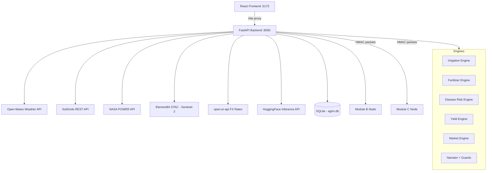

# AgriN Connect v2

> **Real-time agricultural intelligence platform** — connecting farmers across Africa and Asia with live weather, soil, satellite, and AI advisory data.

[](https://python.org)
[](https://fastapi.tiangolo.com)
[](https://react.dev)
[](https://vitejs.dev)

---

## 🚀 Quick Start (localhost)

```bash
# 1. Clone and enter
git clone <repo-url>
cd AGRITECH

# 2. Install all dependencies
make install

# 3. Copy and configure environment
cp .env.example .env
# Edit .env – add HF_TOKEN for AI features

# 4. Seed the database (24 farms, 12 zones)
make seed

# 5. Run smoke test to verify all providers
make smoke

# 6. Start dev servers (backend :8000 + frontend :5173)
make dev
```

Then open **http://localhost:5173**

---

## 🏗️ Architecture



---

## 📡 Data Sources

| Provider | Data | Endpoint |
|---|---|---|
| Open-Meteo | Weather, forecast, flood | `api.open-meteo.com` |
| SoilGrids (ISRIC) | pH, N, SOC, texture | `rest.isric.org` |
| NASA POWER | Solar, temp, precip history | `power.larc.nasa.gov` |
| Element84 STAC | Sentinel-2 NDVI | `earth-search.aws.element84.com` |
| Planetary Computer | Sentinel-2 backup | `planetarycomputer.microsoft.com` |
| open.er-api.com | Currency rates | `open.er-api.com` |
| HuggingFace | LLM + vision | `api-inference.huggingface.co` |

All APIs are **free tier / open access** except HuggingFace (free token required).

---

## 🗺️ Pages

| Page | Route | Description |
|---|---|---|
| Globe Dashboard | `/` | Live globe, weather stats, activity feed |
| Farmer App | `/farmer` | Country → Zone → Farmer drill-down with 4 data tabs |
| Network View | `/network` | Multi-node packet monitor + interop test suite |
| Field 3D Scene | `/field` | Canvas field simulation + NDVI time series |
| Ask AgriN | `/advisory` | AI chat with quick questions + WhatsApp share |

---

## 🔐 Interop Protocol (Module A↔B)

Packets are signed with **HMAC-SHA256** using a shared secret (`INTEROP_SECRET`).

```bash
# 1. Get template
PKT=$(curl -s http://localhost:8000/api/interop/new-packet)

# 2. Sign
SIG=$(curl -s -X POST http://localhost:8000/api/interop/sign \
  -H "Content-Type: application/json" -d "$PKT" | jq -r .signature)

# 3. Send signed (accepted)
echo "$PKT" | jq --arg s "$SIG" '.signature=$s' | \
  curl -s -X POST http://localhost:8000/api/interop/send \
  -H "Content-Type: application/json" -d @-

# 4. Send tampered (rejected)
echo "$PKT" | jq '.signature="tampered"' | \
  curl -s -X POST http://localhost:8000/api/interop/send \
  -H "Content-Type: application/json" -d @-
```

---

## 🧪 Tests

```bash
make test       # Run all unit tests (21 engine tests + integration)
make smoke      # Hit all live providers once, print status table
```

Test coverage: **21 unit tests** for all 6 deterministic engines with adversarial guardrail testing.

---

## 📋 Judging Criteria Mapping

| Criterion | Implementation |
|---|---|
| Live data from ≥4 providers | Open-Meteo, SoilGrids, NASA POWER, Element84, FX Rates |
| Deterministic advisory engines | `app/engines/advisory.py` – 6 engines |
| Multi-node interop | HMAC-SHA256 signed packets, tamper detection |
| AI advisory | HuggingFace Qwen2.5-7B + graceful offline fallback |
| Mobile-responsive UI | 390px breakpoints in `index.css` |
| 24 farms, 12 zones | `seed.py` – 4 countries |
| Narrator guardrails | `narrator_guard()` – banned pattern detection |
| Provenance badges | Every API response shows `provider`, `fetched_at`, `source_url` |

---

## 📁 Project Structure

```
AGRITECH/
├── backend/
│   ├── main.py                 # FastAPI app entry
│   ├── seed.py                 # DB seeder (24 farms)
│   ├── data_sources.py         # Crops DB loader
│   ├── app/
│   │   ├── api/                # All API routers
│   │   ├── services/           # Live data services (P1-P4, FX, LLM)
│   │   ├── engines/            # Deterministic advisory engines
│   │   ├── models/             # SQLAlchemy DB models
│   │   └── schemas/            # Pydantic schemas
│   └── tests/unit/             # 21+ unit tests
├── frontend/
│   └── src/
│       ├── pages/              # Dashboard, FarmerApp, NetworkView, FieldScene, Advisory
│       ├── stores/             # Zustand state stores
│       └── lib/api.js          # API client
├── data/
│   ├── zones/zones.json        # 12 agricultural zones
│   └── crops/crops_db.json     # 18 crop profiles
├── docs/
│   ├── STATUS.md               # Provider preflight results
│   ├── API_EXAMPLES.md         # curl transcripts
│   └── samples/                # Live API response samples
├── scripts/
│   └── smoke_live.py           # Provider smoke test
├── .env.example                # Environment template
└── Makefile                    # make install|dev|test|smoke|seed
```

---

## 🌍 Coverage

- **Countries**: India, Kenya, Nigeria, Ghana
- **Farms**: 24 (8 India, 6 Kenya, 6 Nigeria, 4 Ghana)
- **Zones**: 12 agricultural zones
- **Crops**: 18 (wheat, rice, maize, soybean, sugarcane, cotton, groundnut, sorghum, millet, cassava, potato, tomato, onion, coffee, cocoa, tea, banana, yam)

---

*Built with ❤️ for precision agriculture — AgriN Connect v2*
